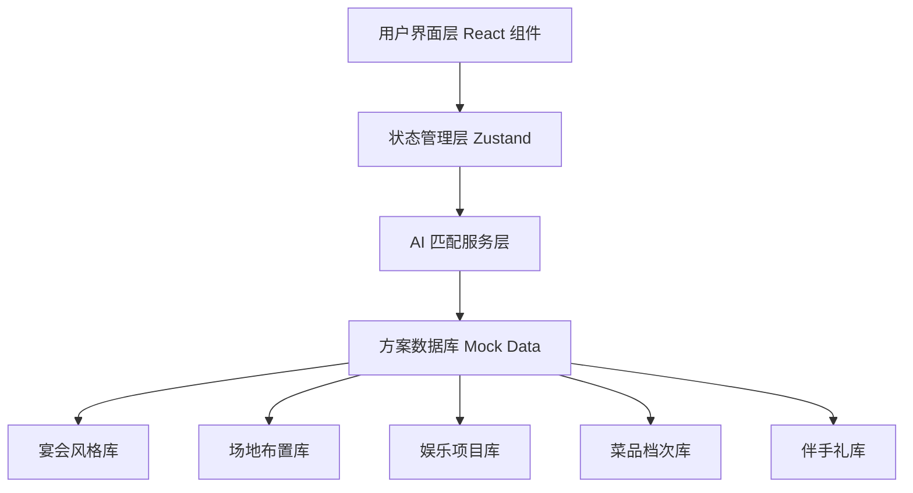

## 1. 架构设计

纯前端单页应用，AI 语义匹配逻辑在前端模拟实现，使用 Mock 数据构建方案库，通过匹配算法根据用户选择的参数生成方案。



## 2. 技术描述

- **前端**：React@18 + TypeScript + Tailwind CSS@3 + Vite
- **初始化工具**：vite-init
- **状态管理**：Zustand
- **后端**：无（纯前端应用，AI 匹配逻辑在前端实现）
- **数据库**：无，使用 TypeScript 数据结构定义 Mock 方案库
- **图标**：Lucide React

## 3. 路由定义

| 路由 | 用途 |
|------|------|
| / | 主页面，包含参数选择、方案展示、预算面板 |

## 4. 数据模型

### 4.1 核心数据类型

```typescript
// 用户选择参数
interface BanquetParams {
  scale: 'small' | 'medium' | 'large' | 'grand';
  venue: 'hotel' | 'outdoor' | 'restaurant' | 'villa' | 'exhibition';
  crowd: 'wedding' | 'business' | 'birthday' | 'family' | 'friend';
  budget: 'economy' | 'standard' | 'premium' | 'luxury';
}

// 宴会方案
interface BanquetPlan {
  id: string;
  name: string;
  style: BanquetStyle;
  decoration: Decoration;
  entertainment: Entertainment[];
  cuisine: Cuisine;
  souvenir: Souvenir;
  totalBudget: number;
  breakdown: BudgetBreakdown;
  matchScore: number;
}

// 预算明细
interface BudgetBreakdown {
  venue: number;
  decoration: number;
  entertainment: number;
  cuisine: number;
  souvenir: number;
  service: number;
}
```

### 4.2 方案库数据结构

- 宴会风格库：古典中式、现代简约、浪漫西式、森系自然、奢华宫廷等
- 场地布置库：花艺类型、灯光方案、舞台设计、桌布装饰等
- 娱乐项目库：乐队表演、魔术互动、游戏环节、抽奖环节等
- 菜品档次库：按菜系和档次分级，包含人均价格
- 伴手礼库：不同价位档次的伴手礼选项

## 5. 核心算法

### 5.1 AI 语义匹配算法

基于权重评分系统，将用户选择的四个维度参数与方案库中各元素进行匹配评分：

1. **规模权重**：影响场地大小、菜品份量、伴手礼数量
2. **场地权重**：影响布置风格、娱乐项目适配性
3. **人群权重**：影响风格偏好、活动类型、菜品选择
4. **预算权重**：决定各档次的价格区间筛选

每个方案元素根据匹配度获得 0-100 分，加权计算总匹配分，取前 3 名生成推荐方案。

### 5.2 实时预算计算

每个可替换元素都有单价，当用户替换时：
- 计算新旧元素差价
- 更新分项预算
- 重新计算总预算
- 触发数字滚动动画

## 6. 项目结构

```
src/
├── components/
│   ├── Header.tsx          # 顶部品牌区
│   ├── ParamSelector.tsx   # 参数选择区
│   ├── PlanSidebar.tsx     # 方案侧边栏
│   ├── PlanDetail.tsx      # 方案详情区
│   ├── BudgetPanel.tsx     # 预算面板
│   ├── ReplaceModal.tsx    # 替换选项弹窗
│   └── ui/                 # 基础 UI 组件
├── data/
│   ├── styles.ts           # 宴会风格库
│   ├── decorations.ts      # 场地布置库
│   ├── entertainment.ts    # 娱乐项目库
│   ├── cuisines.ts         # 菜品库
│   └── souvenirs.ts        # 伴手礼库
├── hooks/
│   └── useBanquetAI.ts     # AI 匹配逻辑 Hook
├── store/
│   └── useBanquetStore.ts  # Zustand 状态管理
├── types/
│   └── banquet.ts          # 类型定义
├── utils/
│   └── budget.ts           # 预算计算工具
├── App.tsx
└── main.tsx
```
